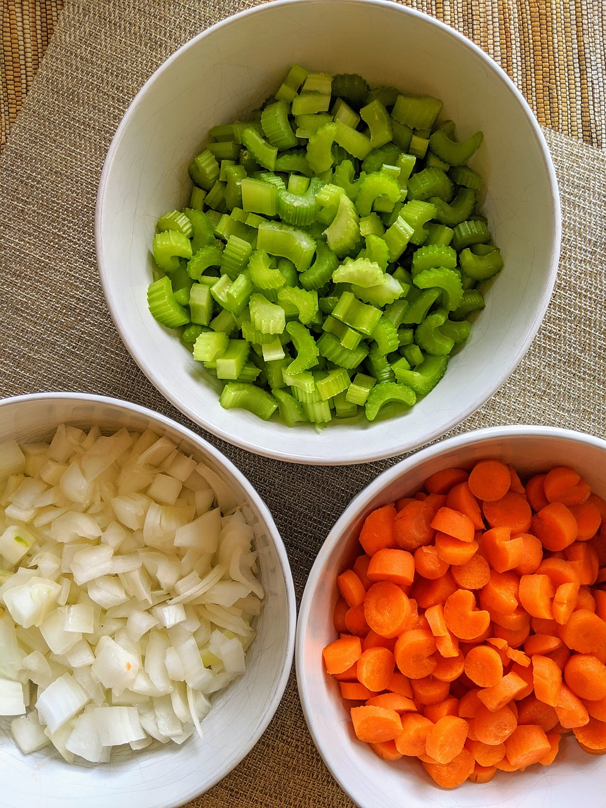
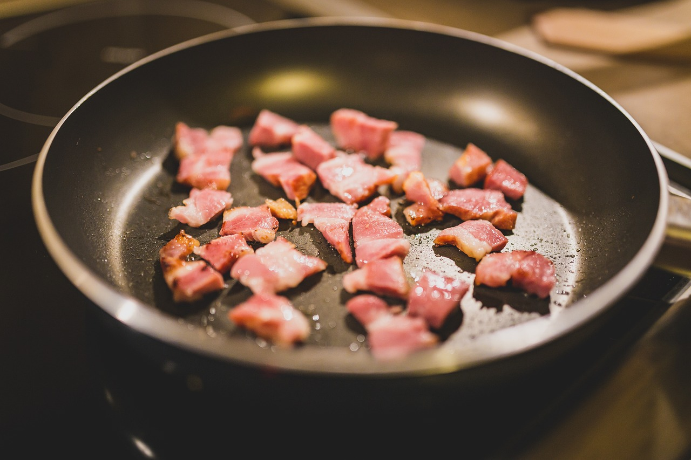
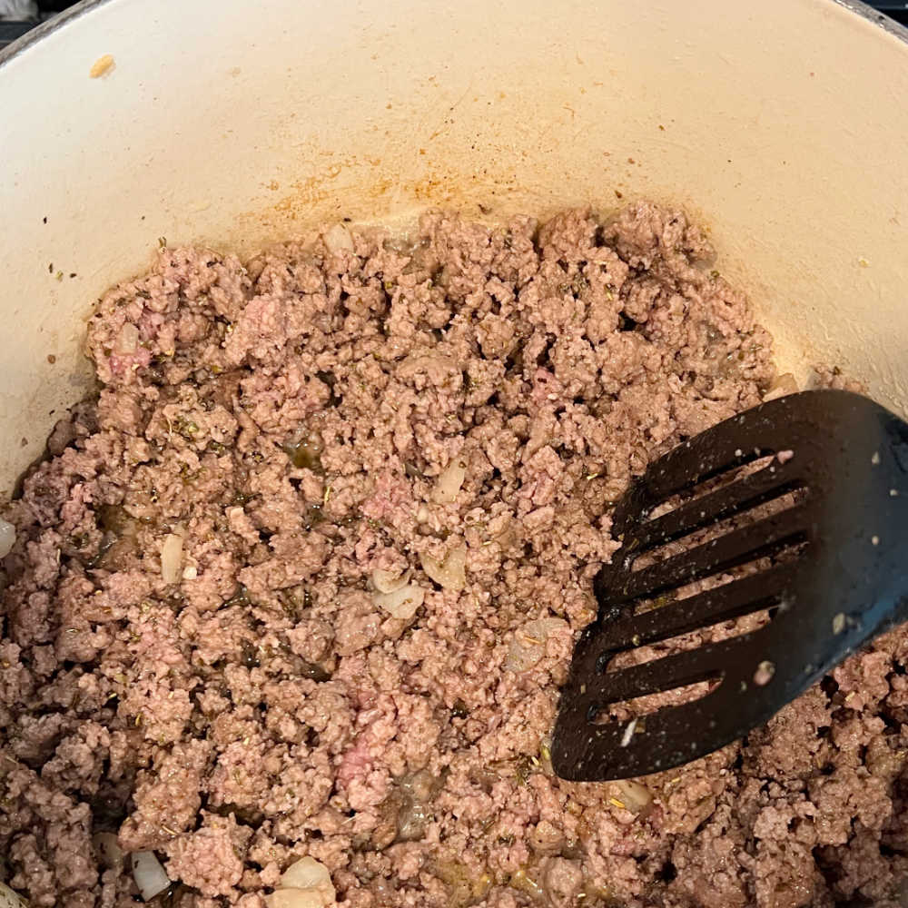
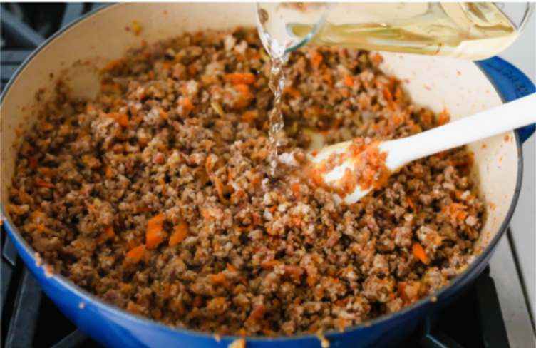

<h1>Delicioso Bolognese Recipe</h1>

<h3> 
   
   &nbsp;&nbsp; By   <a  
  href= "https://www.bluegolf.com/a/#/players/player/jlai124" target= "_blank" > 
  Jaso La </a> 
   on Sep 25, 2022 
  
   
</h3>

  Oh boy do I love bolognese. 
  
<h3>What is bolognese?</h3> 
  Bolognese is a meat sauce originating from Italy. Outside of Italy, most people know bolognese as a tomato sauce with meat in it. This is wrong and an angry Italian man will find you if you ever make bolognese like that. Instead of being a tomato sauce with meat, it's a meat sauce with tomato. It typically contains a soffritto of onions, celery, and carrots; along with minced beef and pork, <strong>WHITE WINE</strong>, tomatoes and tomato paste, and whole milk. 
 
Fun fact: traditionally, only salt and pepper are used as seasoning. Not even any garlic! I won't tell anyone if you use garlic though. There are no herbs either (although bay leaves may be authentic. I don't know. I'm just some kid doing a comp sci project).

Bolognese is typically served in lasagna or over a thick pasta like tagliatelle. You can try putting it over spaghetti, but you will incur the wrath of a thousand Italians.

    
By hozinja - Flickr: Good old spaghetti bolognese, CC BY 2.0
  

 
  Looks good, but is it worth the risk?

 
<h3>Ingredients</h3>

  <ul>
    <li>300 grams each of ground pork and beef</li>
    <li>300 grams of pancetta</li>
    <li>100 grams each of carrots, celery, and onion</li>
    <li>240 ml of white wine</li>
    <li>1 can of crushed tomatoes</li>
    <li>60 grams of tomato paste</li>
    <li>240 ml of whole milk</li>
  </ul>

<h3>How to make bolognese</h3>

 
  <ol type="1">
    <li>First, you want to prep your vegetables. Finely chop your onions, carrots, and celery. </li> 
         
    <li>Add pancetta to a large pot and slowly render out the fat. (You can use bacon instead but don't tell anyone I said that.)</li>  
         
    <li>Remove your pancetta and add your ground beef and pork and get it nice and brown.</li>      
    <li>Add the chopped vegetables and deglaze with white wine. Add tomato paste, pancetta, and the questionably authentic bay leaf.</li>     
    <li>Let the sauce simmer until you lose patience, ideally 2-3 hours. Add stock or water if the sauce is getting dry.</li>
    <li>In the last few minutes of cooking, add milk. </li>
  </ol>

